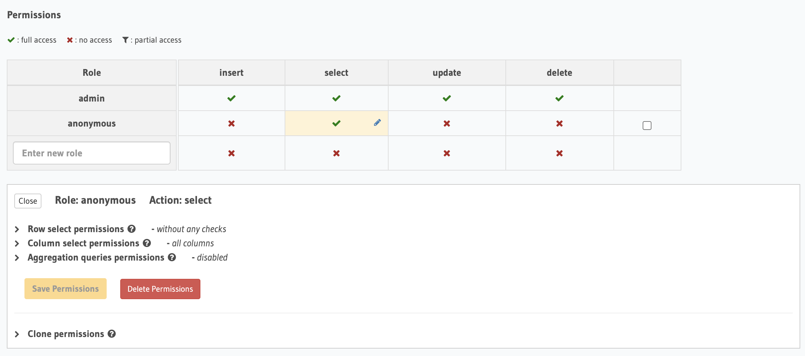

# Description

This is just a little project to help me gain some familiarity with [Hasura](https://hasura.io/).
It is a React web app written in TypeScript. It uses Apollo Client to talk to the GraphQL API that
Hasura provides over a sample PostgreSQL database.

## Running Locally

When running locally, I use docker compose to run PostgreSQL and Hasura GraphQL Engine in Docker containers.

## Running on Heroku

When running on Heroku, I use:

* [Heroku Postgres](https://elements.heroku.com/addons/heroku-postgresql)
* [Hasura Cloud](https://hasura.io/cloud/)

# Authentication

When running locally, it all just worked. However, when I initially deployed to Heroku, I got the following error:

```
{
    "errors": [{
        "extensions": {
            "path": "$",
            "code": "access-denied"
        },
        "message": "x-hasura-admin-secret/x-hasura-access-key required, but not found"
    }]
} 
```

To try to get it working, I set the `HASURA_GRAPHQL_UNAUTHORIZED_ROLE` env var to `anonymous`.
I then got a different error:

```
{
    "errors": [{
        "extensions": {
            "path": "$.selectionSet.film",
            "code": "validation-failed"
        },
        "message": "field \"film\" not found in type: 'query_root'"
    }]
}
```

I then adjusted the permissions on the `film` table to allow the `anonymous` role to perform `select`:



It is working now.

# Links

* [Hasura](https://hasura.io/)
  * [Hasura GraphQL Engine Documentation](https://hasura.io/docs/latest/graphql/core/index.html)
* [PostgreSQL Sample Database](https://www.postgresqltutorial.com/postgresql-sample-database/)
  * [dvdrental.zip](https://www.postgresqltutorial.com/wp-content/uploads/2019/05/dvdrental.zip)
* [Heroku Postgres](https://devcenter.heroku.com/categories/heroku-postgres)
  * [Importing and Exporting Heroku Postgres Databases](https://devcenter.heroku.com/articles/heroku-postgres-import-export)
